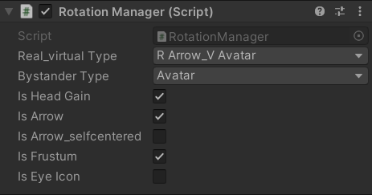
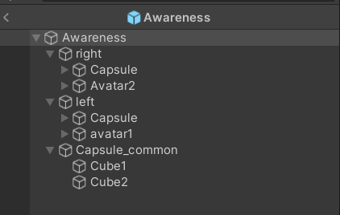
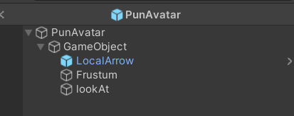

## Rotation Manager

To manage the various configurations of head rotation gain and bystander awareness, we implemented a Rotation Manager. This manager allows flexible control over different settings related to bystander types and head rotation features. The Rotation Manager includes the following key functionalities:

- **Bystander Type Selection**: The system can switch between different bystander representations (avatars or capsules). Notably, Mix90 is just for Angle90 formation, it would display both an avatar and a commonCapusle.
- **HeadGain Toggle**: The head rotation gain feature can be turned on or off based on the current scenario.
- **Arrow Indicator Toggle**: Allows enabling or disabling the arrow indicator (both local and remote players should keep this consistent).
- **Centered Arrow Toggle**: Allows enabling or disabling a self-centered arrow for the local player, providing clearer feedback about the remote player's head orientation.
- **Frustum Display Toggle**: Allows enabling or disabling the frustum (both local and remote players should keep this consistent).
- **Eye Icon Toggle**: Allows enabling or disabling the eye icon, which provides feedback on the local player’s own head rotation towards bystanders.

  

Make sure that selecting the Bystander Type before starting the task. While, The toggles(isHeadGain,isArrow...) can be checked or dischecked during the task.

You can drag the **headCube** to the "Head" of **Awareness** to debug and test the related functions of head rotaion.

## Script Details

This section outlines the scripts used to implement head rotation gain and the bystander awareness mechanism. The primary scripts involved are `GetHeadRotation.cs` and `RealRotation.cs`.

### Script: GetHeadRotation.cs

The `GetHeadRotation.cs` script is attached to the Awareness prefab, which includes the left and right bystanders (avatars and capsules are children of the left and right areas, respectively). For the Angle90 formation, a specialized two-faced capsule can be used to replace the normal capsule.

  
*Figure: Structure of the Awareness Prefab.*

Below are the public and private variables defined in this script.

```
#region Public field
    public GameObject playerAreaCenter;
    public TaskManager taskManager;
    public Transform head;
    public GameObject avatar;
    public GameObject avatar2;
    public GameObject leftCapsule;
    public GameObject rightCapsule;
    public GameObject commonCapsule;
    public Transform leftT;
    public Transform rightT;
    public eyeBlink eye;
    public Material cube_local;
    public Material cube_remote;
    [Range(0.0f, 1.0f)] public float transparency = 0f;

    #endregion

    #region Private field
    private RotationManager rotationManager;
    private int Remote; //1 for left avatar, 2 for right avatar, use pun to send to others' client
    private float headRotationY;
    private bool avatarTransformed = false;
    private bool Angled90;
    private bool sideByside;
    private GameObject leftBystander;
    private GameObject rightBystander;
    #endregion
```

- **playerAreaCenter**: A GameObject used to localize the Awareness prefab, ensuring that bystanders appear at the side seats of the player. If head rotation gain is enabled, this object also serves as the parent GameObject to apply additional rotation (0.5x) for the VR camera's 1x rotation.
- **taskManager, rotationManager**: The `taskManager` checks whether the player is local or remote and retrieves the task state. The `rotationManager` determines the bystander type and handles other toggle functions.
- **head**: Refers to the head of either the local or remote network player. It tracks the physical head rotation of the VR player.
- **Avatar, Capsule, leftT, rightT**: Depending on the selected bystander type (Avatar, Capsule, or a Mix), other types will be disabled. For specific formations (e.g., Angle90), bystanders may be replaced by the common two-faced capsule or hidden to avoid overcrowding in the scene.
- **eye**: Controls the blinking of the eye icon.
- **cube**: Used to apply materials to the faces of capsules. The local capsule is red, and the remote capsule is blue. To prevent rendering issues, the faces have a different render queue (3001) compared to the capsule body (3000).
- **Remote**: Part of the bystander material synchronization process. It ensures the same transparency for bystanders on the remote client by sending information about the bystander (1 for left, 2 for right) to the remote client.
- **avatarTransformed**: Manages bystander transformations when rotation gain is activated. When the task begins, bystanders are placed farther away compared to when gain is off.

#### void start()
Based on the Bystander Type, hide opposite expression. For example, if the type is Capsuel, it would hide the Avatars (*setActive(false)*).

And for Capsule type, we will add the material to the capsule'face(it's a cube). For local player's bystanders, they are red. For remote player's bystanders, they are blue. (There is a similar function in the **SetRendererTransparency** method, as it will change the capsule body's color). As explained in the previous introudction of the **cube_local** and **cube_remote**, capusle body and face should have different render queues to avoid render issue.

```
if bystander type is capsule or mix
//add bystander(capsule_face) material
//local bystander is red, remote is blue
//left and right bystander use same materials
GameObject leftcube = leftCapsule.transform.GetChild(0).gameObject;
GameObject rightcube = rightCapsule.transform.GetChild(0).gameObject;
Renderer left_renderer = leftcube.GetComponent<Renderer>();
Renderer right_renderer = rightcube.GetComponent<Renderer>();
Material[] materials = left_renderer.materials;
Material[] newmaterials = new Material[materials.Length + 1];
for (int i = 0; i < materials.Length; i++)
{
    newmaterials[i] = materials[i];
}
if (!taskManager.isRemotePlayer)
{   
    
    if (photonView.IsMine)
    {  
        //red capsule face
        newmaterials[newmaterials.Length - 1] = cube_local;               
    }
    else
    {
        //blue capsule face
        newmaterials[newmaterials.Length - 1] = cube_remote;
    }
    
}
else
{
    if (photonView.IsMine)
    {

        //blue capsule face
        newmaterials[newmaterials.Length - 1] = cube_remote;

    }
    else
    {

        //red capsule face
        newmaterials[newmaterials.Length - 1] = cube_local;
    }

        
}
left_renderer.materials = newmaterials;
right_renderer.materials = newmaterials;


``` 
Also for different formation, we should place the bystanders differetly. For example, if it is the Angle90 formation, it would use a commonCapulse to replace the regular capsule.
```
if bystander type is capusle or mix
//  for angled90 
            if (taskManager.collabType == CollabType.Angled90)
            {
                if (taskManager.isRemotePlayer)
                {

                    if (photonView.IsMine)
                    {
                        //set left to commoncapsule,hide leftavatar and leftcapsule
                        avatar.SetActive(false);
                        leftCapsule.SetActive(false);
                        leftBystander = commonCapsule;
                        commonCapsule.transform.SetParent(leftT);
                        commonCapsule.transform.localRotation = Quaternion.Euler(new Vector3(0, 135, 0));
                        commonCapsule.transform.localPosition = new Vector3(-0.6f, 0.8f, -0.1f);
                        if (rotationManager.bystanderType == BystanderType.Capsule) 
                        { 
                            rightBystander = rightCapsule;
                            avatar2.SetActive(false);
                        } 
                        else{
                            rightBystander = avatar2;
                            rightCapsule.SetActive(false);
                        }

                    }
                    else
                    {
                        avatar2.SetActive(false);
                        rightCapsule.SetActive(false);
                        rightBystander = commonCapsule;
                        commonCapsule.SetActive(false);
                        if (rotationManager.bystanderType == BystanderType.Capsule)
                        { 
                            leftBystander = leftCapsule;
                            avatar.SetActive(false) ;
                        }
                        else { 
                            leftBystander = avatar;
                            leftCapsule.SetActive(false);

                        }


                    }
                }
                else
                {
                    if (photonView.IsMine)
                    {
                        avatar2.SetActive(false);
                        rightCapsule.SetActive(false);
                        rightBystander = commonCapsule;
                        commonCapsule.transform.SetParent(rightT);
                        commonCapsule.transform.localPosition = new Vector3(0.6f, 0.8f, -0.1f);
                        if (rotationManager.bystanderType == BystanderType.Capsule)
                        { 
                            leftBystander = leftCapsule;
                            avatar.SetActive(false);
                        }
                        else { 
                            leftBystander = avatar;
                            leftCapsule.SetActive(false);
                        }


                    }
                    else
                    {
                        avatar.SetActive(false);
                        leftCapsule.SetActive(false);
                        leftBystander = commonCapsule;
                        commonCapsule.SetActive(false);
                        if (rotationManager.bystanderType == BystanderType.Capsule)
                        { 
                            rightBystander = rightCapsule;
                            avatar2.SetActive(false);
                        }
                        else { 
                            rightBystander = avatar2;
                            rightCapsule.SetActive(false);
                        }
                    }
                }
            }
            //other CollabType... just normal capusles
            else 

```
And for other CollabType like sidebyside, we should do a small trick because so many bystanders and avatars in the scene. For each player, there will be a bystander of the other guy at the same position with he/she(I mean, it's like player is inside of a capsule or avatar, player may cannt see anything), so of course we need to hide this one.
```
// for sidebyside condition
        if (taskManager.collabType == CollabType.SideBySide)
        {
            //hide the avatar to avoid blocking user's view
            if (taskManager.isRemotePlayer)
            {
                if (photonView.IsMine)
                {
                    //leftT.gameObject.SetActive(false);

                }
                else
                {
                    rightT.gameObject.SetActive(false);
                }
            }
            else
            {
                if (photonView.IsMine)
                {
                   // rightT.gameObject.SetActive(false);
                }
                else
                {
                    leftT.gameObject.SetActive(false);
                }
            }
            sideByside = true;

        }else if (taskManager.collabType == CollabType.Angled90){

            Angled90 = true;

        }
        else if (taskManager.collabType == CollabType.CoupledView)
        {
            //for coupled view, we don't need the photon transform view and material view
            //just let the avatars be lcoal
            //not sure if it's good or bad
            photonView.Synchronization = ViewSynchronization.Off;

        }
```


#### void update()
Transform the bystanders when head gain is turned on(when task starts).
```
 if ((taskManager.taskStarted||taskManager.taskStartedP2) && photonView.IsMine)
            {
                //disable the PhotonTransformView if task starts
                gameObject.GetComponent<PhotonTransformView>().enabled = false;
                // with head gain, we should slight modify the position of the bystanders
                if (rotationManager.isHeadGain && !avatarTransformed)
                {
                    leftT.Rotate(0, -30, 0, Space.World);
                    rightT.Rotate(0, 30, 0, Space.World);

                    avatarTransformed = true;
                }
                else if(!rotationManager.isHeadGain && avatarTransformed)
                {
                    leftT.localEulerAngles = Vector3.zero;
                    rightT.localEulerAngles = Vector3.zero;
                    avatarTransformed = false;
                }
                
            }
```

The following code are using the head rotation value to change transparency.
Using **SetChildrenTransparency** to change the bystander transparency, it will call the **SetRendererTransparency** and change each renderer of the bystander.


### Script: RealRotation.cs

The `RealRotation.cs` script is attached to a GameObject in the `PunAvatar` prefab, which contains the arrow, frustum, and `lookAt` object. These elements are used to point the arrow toward the player's line of sight.

  
*Figure: Structure of the PunAvatar Prefab.*

Below are the public and private variables defined in this script.

```
 public GameObject selfarr;
    public TaskManager taskManager;
    private RotationManager rotationManager;
    public Transform arrow;
    public Transform frustum;
    private Transform lookAt;
    private Transform otherlookat;

    private bool isPlaced=false;
    public Transform head;
    private Material material;
    public Quaternion adjustRotaion;
    private int arrowColor = -1;
    private bool adjusted = false;
```

- **selfarr, lookAt, otherlookat**: The `selfarr` refers to the self-centered arrow, which is a child of the `CenterEyeAnchor` for viewing. The `lookAt` object aligns with the player's line of sight. When both the local and remote players start the task, the self-centered arrow points at the `otherlookat` object to indicate where the other player is looking.
- **head, arrow, frustum**: The arrow and frustum indicate the player's line of sight based on the rotation of the head object.
- **material, arrowColor**: The `material` variable allows for the change of the arrow's color (for different gaze intrusion zones). A custom synchronization system ensures that the arrow's color remains consistent across both local and remote scenes.
- **isPlaced**: Used for placing objects as children of the head of the player's avatar so that the arrow and frustum will follow the player's movement.

#### void start()
Just get the objects we need.
```

        taskManager = GameObject.FindObjectOfType<TaskManager>();

        arrow = transform.GetChild(0);
        frustum = transform.GetChild(1);
        lookAt = transform.GetChild(2);
        material = arrow.GetComponent<Renderer>().material;
        rotationManager = GameObject.FindObjectOfType<RotationManager>();
        selfarr = GameObject.Find("selfArrow");
```
#### void update()
We should put current gameobject(contains arrow and frustum) into the "Joint Head".
 if (!isPlaced)
        {
            //don't know when the avatr head is created, check if the head exists
            //put this gameobject into "Joint Head" so that it can follow the head movement
            if (transform.parent.childCount > 1) {
                transform.SetParent(transform.parent.GetChild(1));
                isPlaced = true;
            }
        }

While for different CollabType, the player2's area is changed. We need to get this rotation so that we apply it to the arrow and frustum.

```
//adjustRotation should be same as the PlayerAreaRotation(related to Collabtype)
        // Player1 is default(0,0,0), just do for Player2
        if (!adjusted && taskManager.isRemotePlayer)
        {
            if(taskManager.collabType == CollabType.FacetoFaceIntersect)
            {
                adjustRotaion = Quaternion.Euler(0, 180, 0);
            }else if(taskManager.collabType == CollabType.FaceToFaceNoIntersect)
            {
                adjustRotaion = Quaternion.Euler(0, 180, 0);

            }else if(taskManager.collabType == CollabType.Angled90)
            {
                adjustRotaion = Quaternion.Euler(0, 270, 0);

            }
            else
            {
                adjustRotaion = Quaternion.Euler(0, 0, 0);
            }
            adjusted = true;

        }else if (!adjusted && !taskManager.isRemotePlayer)
        {
            adjustRotaion = Quaternion.Euler(0, 0, 0);
            adjusted = true;

        }
```

Use the head rotation(just y axis) to change the color of the arrow and also where the arrow or frustum should point.
```
        if (isPlaced && adjusted && photonView.IsMine)
        {
            //transform.parent == Joint Head
            //transform.parent.parent == Local Avatar
            if (!head)
            {
                //get the head of local player
                GameObject go = GameObject.Find("Local Network Player");
                if (go != null)
                {
                    head = go.GetComponent<NetworkPlayer>().head;
                }
                gameObject.name = "Local";
            }
            else
            {
                float headRotationY = head.localRotation.eulerAngles.y;
                if (headRotationY > 180)
                {
                    //for negative rotation(turn left), the value is between 270-360
                    headRotationY = 360 - headRotationY;
                }
                if (headRotationY < 30.0f)
                {
                    arrowColor = 0;
                }
                else if (headRotationY < 60.0f)
                {
                    arrowColor = 1;
                }
                else if (headRotationY < 90.0f)
                {
                    arrowColor = 2;
                }
                Quaternion headRotation = head.localRotation;

                if (rotationManager.real_virtualType == RealVirtualType.RArrow_VAvatar)
                {
                    
                    arrow.transform.rotation = headRotation * adjustRotaion * Quaternion.Euler(90, 90, 0);
                    frustum.transform.rotation = headRotation * adjustRotaion;
                }
                else if(rotationManager.real_virtualType == RealVirtualType.RAvatar_VArrow)
                {
                    //since the roatation gain function changes the PlayerCenter, we should keep the avatar at the original position
                    // maybe just show it from the remote player's view...
                    transform.parent.parent.rotation = headRotation * adjustRotaion;
                    if(headRotation.eulerAngles.y > 180)
                    {
                        arrow.transform.rotation = Quaternion.Euler(headRotation.eulerAngles.x, 360.0f- 1.5f * headRotationY, headRotation.eulerAngles.z) * adjustRotaion * Quaternion.Euler(90, 90, 0);

                    }
                    else
                    {
                        arrow.transform.rotation = Quaternion.Euler(headRotation.eulerAngles.x, 1.5f * headRotationY, headRotation.eulerAngles.z) * adjustRotaion * Quaternion.Euler(90, 90, 0);

                    }

                }
               
            }
        }
```
Disable or enable the arrow/frustum accordinf to the rotationManager.
```
if (rotationManager.isArrow)
        {
            arrow.gameObject.SetActive(true);
        }
        else
        {
            arrow.gameObject.SetActive(false);
        }
if(rotationManager.isFrustum)
        {
            frustum.gameObject.SetActive(true);
        }
        else
        {
            frustum.gameObject.SetActive(false);
        }

```
Enable or disable the selfcentered arrow. We use **transform.lookAt** to rotate this arrow. Since this arrow is pointing at the other's turning direction, it should look at **otherlookat** which is created by the remote machine and synchronized by photon. So this arrow would only work when 2 players are online.
```
 if(rotationManager.isArrow_selfcentered)
        {
            selfarr.gameObject.SetActive(true);
            if (photonView.IsMine)
            {
                //hide my "lookat"
                lookAt.gameObject.name = "lookat_hide";
                lookAt.gameObject.SetActive(false);
            }
            else
            {
                lookAt.gameObject.SetActive(true);

            }
            if (!otherlookat)
            {
                otherlookat = GameObject.Find("lookAt").transform;


            }
            else
            {
                selfarr.transform.LookAt(otherlookat);
                selfarr.transform.Rotate(new Vector3(90, 90, 0));
            }
        }

```

### other scripts
#### eyeBlink.cs
Control the eye icon images based on the head rotation, the method **UpdateEye(int transparency, bool LeftorRight)** will be called by **GetHeadRotation**.
#### FrustumDrawer
A simple script to draw a frustum with some parameters(eg. Foc,Near,Far...).

